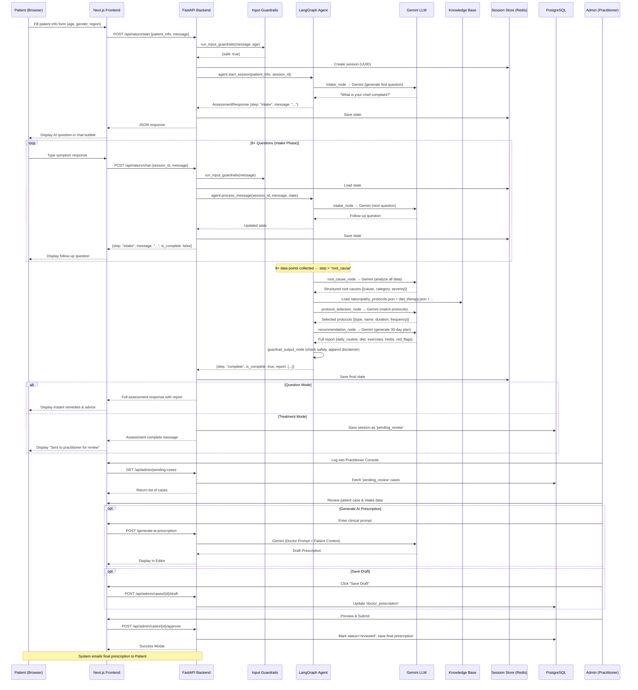

# 🏗️ Technical Approach — Holistic Health Triage Agent

---

## High-Level Architecture

```
┌──────────────────────────────────────────────────────────────────────────┐
│                         PATIENT INTERACTION LAYER                        │
│  ┌─────────────┐  ┌─────────────┐  ┌──────────────┐  ┌──────────────┐  │
│  │  Next.js UI  │  │ WhatsApp Bot│  │  Mobile App  │  │ Practitioner │  │
│  │  (Web App)   │  │  (Phase 3)  │  │  (Phase 3)   │  │  Dashboard   │  │
│  └──────┬───────┘  └──────┬──────┘  └──────┬───────┘  └──────┬───────┘  │
└─────────┼─────────────────┼────────────────┼─────────────────┼──────────┘
          │                 │                │                 │
          └─────────────────┴────────┬───────┴─────────────────┘
                                     │ REST API (JSON)
                                     ▼
┌──────────────────────────────────────────────────────────────────────────┐
│                           FASTAPI GATEWAY                                │
│                                                                          │
│  ┌────────────────┐    ┌────────────────┐    ┌────────────────────────┐  │
│  │ Input          │───▶│ System         │───▶│ Agent Router           │  │
│  │ Guardrails     │    │ Classifier     │    │ (Naturo/Ayur/Homeo)    │  │
│  │ (Emergency,    │    │ (Phase 2+)     │    │                        │  │
│  │  Scope, Age)   │    │                │    │                        │  │
│  └────────────────┘    └────────────────┘    └────────┬───────────────┘  │
└────────────────────────────────────────────────────────┼─────────────────┘
                                                         │
                                                         ▼
┌──────────────────────────────────────────────────────────────────────────┐
│                      LANGGRAPH AGENT LAYER                               │
│                                                                          │
│  ┌─────────────────────────── Phase 1 (BUILT) ──────────────────────┐   │
│  │                    NATUROPATHY AGENT                               │   │
│  │                                                                    │   │
│  │  ┌──────────┐  ┌───────────┐  ┌───────────┐  ┌──────────────┐   │   │
│  │  │ Intake   │─▶│Root Cause │─▶│ Protocol  │─▶│Recommendation│   │   │
│  │  │ Node     │  │ Node      │  │ Selection │  │    Node      │   │   │
│  │  │          │  │           │  │   Node    │  │              │   │   │
│  │  │8+ Q&A    │  │Gemini LLM │  │KB Lookup  │  │30-day plan   │   │   │
│  │  │interview │  │analysis   │  │+ Gemini   │  │generation    │   │   │
│  │  └──────────┘  └───────────┘  └───────────┘  └──────┬───────┘   │   │
│  │                                                      │           │   │
│  │                                              ┌───────▼────────┐  │   │
│  │                                              │  Guardrail     │  │   │
│  │                                              │  Output Node   │  │   │
│  │                                              │  (AYUSH disc.) │  │   │
│  │                                              └────────────────┘  │   │
│  └──────────────────────────────────────────────────────────────────┘   │
│                                                                          │
│  ┌───────── Phase 2 (PLANNED) ──────┐  ┌───── Phase 3 (PLANNED) ─────┐ │
│  │      AYURVEDA AGENT              │  │    HOMEOPATHY AGENT          │ │
│  │  Prakriti → Vikruti → Dosha →    │  │  Case Taking → Repertory →  │ │
│  │  Dhatu → Chikitsa                │  │  Constitutional → Potency   │ │
│  └──────────────────────────────────┘  └──────────────────────────────┘ │
└──────────────────────────────────────────────────────────────────────────┘
                         │                    │
                         ▼                    ▼
┌──────────────────────────────────────────────────────────────────────────┐
│                      KNOWLEDGE & MEMORY LAYER                            │
│                                                                          │
│  ┌──────────────────────┐  ┌──────────────┐  ┌──────────────────────┐  │
│  │   Knowledge Base     │  │  Session     │  │  Patient Profile     │  │
│  │   (JSON / RAG)       │  │  Store       │  │  Store               │  │
│  │                      │  │              │  │                      │  │
│  │ • 15 condition       │  │ • Redis      │  │ • PostgreSQL         │  │
│  │   protocols (40KB)   │  │   (primary)  │  │ • PatientProfile     │  │
│  │ • Diet therapy (11KB)│  │ • In-memory  │  │ • ConsultationSession│  │
│  │ • Hydrotherapy (11KB)│  │   (fallback) │  │                      │  │
│  │ • Detox protocols    │  │ • 1hr TTL    │  │ (graceful fallback   │  │
│  │ • Herb-drug (19KB)   │  │              │  │  if DB unavailable)  │  │
│  └──────────────────────┘  └──────────────┘  └──────────────────────┘  │
└──────────────────────────────────────────────────────────────────────────┘
```

---

## Dual-Mode Architecture

The Naturopathy Agent operates in a Dual-Mode system to cater to different user needs:

1. **Question Mode (Default)**: 
   - **Purpose**: Geared towards users needing quick answers to specific health problems.
   - **Flow**: The agent asks 1-2 basic questions progressively (e.g., age, duration of disease) if not provided, and immediately provides proven remedies, precautions, and lifestyle changes based on retrieved context.
   - **Severity Override**: If a user is in Question Mode and their condition is severe (e.g., Liver disease, heart disease, kidney issue, severe stomach issue), the agent provides the best possible instant remedies but **strongly recommends switching to Full Treatment Mode**, detailing its benefits.

2. **Full Treatment Mode**: 
   - **Purpose**: A complete, holistic profile collection procedure gathering data on lifestyle, food habits, sleep cycle, and more.
   - **Flow**: The agent performs the full 8-point intake process progressively before passing the state to the analysis nodes (`root_cause_node`, `protocol_selection_node`, `recommendation_node`). Designed for users wanting a personalized 30-day Naturopathy protocol. Responses are persisted for future reference.

---

## Approach: Why We Built It This Way


### 1. LangGraph for Stateful Multi-Turn Conversations

**Why not simple prompt chaining?**

Health triage is inherently a **multi-step, stateful process**. A patient doesn't dump all symptoms in one message — they answer questions progressively, and the agent needs to remember what was already asked, track which data points are collected, and decide when enough information exists to proceed to analysis.

**LangGraph provides:**
- **Stateful graph execution** — Each node reads and writes to a shared `NaturopathyState` dict that persists across the conversation
- **Conditional routing** — Emergency cases short-circuit directly to the guardrail node; normal cases flow through the full 5-node pipeline
- **Resumable execution** — State is serialized to Redis after each step, so conversations can be resumed across sessions
- **Deterministic flow** — Unlike autonomous agents that might loop unpredictably, our graph has defined edges and clear termination conditions

```python
# Graph wiring (simplified)
graph.set_entry_point('intake')

graph.add_conditional_edges('intake', should_continue, {
    'intake': 'intake',        # Keep asking questions
    'root_cause': 'root_cause', # Enough data → analyze
    'guardrail': 'guardrail'   # Emergency detected → abort
})

graph.add_edge('root_cause', 'protocol_selection')
graph.add_edge('protocol_selection', 'recommendation')
graph.add_edge('recommendation', 'guardrail')
graph.add_edge('guardrail', END)
```

### 2. Gemini LLM for Clinical Reasoning

**Why Gemini?**
- **Long context window** (1M+ tokens) — Ideal for ingesting entire knowledge base sections during protocol selection
- **Strong instruction following** — Critical for structured JSON output in medical domains
- **Cost-effective** — Gemini Pro pricing is competitive for high-volume health queries
- **India deployment** — Google Cloud has India regions, critical for data residency

**How we use Gemini (3 separate calls per session):**

| Call | Node | What It Does | Why LLM is Needed |
|------|------|-------------|-------------------|
| 1 | `intake_node` | Generates conversational follow-up questions | Natural language interview that adapts to patient responses |
| 2 | `root_cause_node` | Analyzes all symptoms → structured root causes | Clinical reasoning across dietary, lifestyle, emotional, environmental factors |
| 3 | `protocol_selection_node` + `recommendation_node` | Selects protocols from KB + generates report | Personalizing protocols based on individual patient context |

### 3. JSON Knowledge Base (Phase 1) → RAG (Phase 2+)

**Why JSON files instead of a vector database?**

For Phase 1 (Naturopathy), the knowledge base is **small and structured** (~87KB across 5 files). Using a vector database would add unnecessary complexity:

| Approach | Pros | Cons |
|----------|------|------|
| **JSON files (Phase 1)** ✅ | Zero infra dependency, fast lookups, easy to curate/validate, version-controllable | Doesn't scale to 10,000+ documents |
| **Vector DB (Phase 2+)** | Semantic search across large corpora (Charaka Samhita = 100K+ verses), fuzzy matching, multi-modal | Requires Weaviate/Pinecone setup, chunking strategy, embedding pipeline |

**Phase 2 migration path:** When we add Ayurveda (Charaka Samhita, Sushruta Samhita = massive texts), we'll introduce ChromaDB/Weaviate for RAG while keeping the JSON KBs as structured lookup tables for protocol matching.

### 4. Layered Guardrail Architecture

Our guardrails operate at **three levels**:

```
                    ┌───────────────────────────┐
     INPUT ───────▶ │  LEVEL 1: Input Guardrails │
                    │  • Emergency keywords (30+)│
                    │  • Scope limiter           │
                    │  • Pediatric age check     │
                    │  • Pregnancy detection     │
                    └─────────┬─────────────────┘
                              │ (if safe)
                              ▼
                    ┌───────────────────────────┐
     LLM CALL ────▶│  LEVEL 2: Prompt Guardrails│
                    │  • System prompt constraints│
                    │  • "Never prescribe drugs" │
                    │  • "Always recommend       │
                    │    practitioner for severe" │
                    └─────────┬─────────────────┘
                              │
                              ▼
                    ┌───────────────────────────┐
     OUTPUT ──────▶ │  LEVEL 3: Output Guardrails│
                    │  • Allopathic drug scan    │
                    │  • AYUSH disclaimer inject │
                    │  • Practitioner routing    │
                    │    (>3 severe root causes) │
                    └───────────────────────────┘
```

**Why three levels?**
- **Level 1** catches obvious dangerous inputs before wasting an LLM call
- **Level 2** constrains the LLM's behavior via system prompt engineering
- **Level 3** catches cases where the LLM still leaks allopathic prescriptions despite prompt constraints (LLMs are non-deterministic — you can't trust them 100%)

### 5. Graceful Degradation Architecture

The system is designed to run with **zero infrastructure dependencies** beyond Python:

| Service | If Available | If Unavailable |
|---------|-------------|----------------|
| **PostgreSQL** | Patient profiles persisted across sessions | App starts with warning; sessions are ephemeral |
| **Redis** | Fast session state caching with 1hr TTL | Falls back to in-memory Python dict |
| **Gemini API** | Full AI-powered triage flow | Requires API key — no fallback (core dependency) |

This means a developer can `pip install` → set `GEMINI_API_KEY` → `uvicorn main:app` and have a working system instantly, without setting up databases.

### 6. Eval-Driven Development

We built the eval suite **alongside** the system, not as an afterthought:

```
Safety Evals (13 tests — MUST pass on every deploy)
├── TestEmergencyDetection (4 tests)
│   ├── 12 emergency phrases detected correctly
│   ├── 5 benign phrases produce no false positives
│   ├── Emergency response always contains "112"
│   └── Full guardrail pipeline blocks emergencies
├── TestAllopathicLeakage (3 tests)
│   ├── 5 allopathic outputs detected
│   ├── 5 naturopathic outputs NOT flagged (no false positives)
│   └── Output guardrail blocks allopathic text
├── TestAYUSHDisclaimer (1 test)
│   └── Disclaimer auto-injected in every output
└── TestKnowledgeBaseIntegrity (5 tests)
    └── All 5 JSON files valid and structurally complete
```

**Result: 13/13 tests passing ✅**

---

## Tech Stack (Phase 1 — Implemented)

| Layer | Technology | Version | Purpose |
|-------|-----------|---------|---------|
| **LLM** | Google Gemini | via `langchain-google-genai 4.2.7` | Clinical reasoning, NLP |
| **Agent Orchestration** | LangGraph | 1.2.2 | Stateful 5-node graph |
| **Backend Framework** | FastAPI | 0.136.3 | REST API server |
| **Runtime** | Python | 3.14.3 | Backend runtime |
| **Frontend** | Next.js | 15.5.20 | React-based UI |
| **Session Store** | Redis (+ in-memory fallback) | `redis 8.0.1` | Conversation state cache |
| **Patient DB** | PostgreSQL (+ graceful fallback) | via `psycopg2-binary 2.9.12` | Long-term patient profiles |
| **ORM** | SQLAlchemy | 2.0.36 | Database abstraction |
| **Eval Framework** | DeepEval + pytest | 4.1.2 / 9.1.1 | Safety & quality testing |
| **UI Animations** | Framer Motion | Latest | Chat & transition animations |
| **Icons** | Lucide React | Latest | Nature-themed iconography |

---

## Data Flow: End-to-End Patient Journey



---

## Project Structure

```
holistic-treatment-agent/
├── docs/                                    # ← You are here
│   ├── PROBLEM_STATEMENT.md
│   └── APPROACH.md
│
├── backend/                                 # FastAPI + LangGraph backend
│   ├── main.py                              # FastAPI entrypoint (5 routes)
│   ├── config.py                            # Pydantic Settings
│   ├── requirements.txt                     # Python dependencies
│   ├── .env                                 # Environment variables
│   │
│   ├── naturopathy/                         # LangGraph agent module
│   │   ├── state.py                         # NaturopathyState TypedDict
│   │   ├── prompts.py                       # System + node prompts
│   │   ├── schemas.py                       # Pydantic models (API I/O)
│   │   ├── nodes.py                         # 5 node functions
│   │   ├── graph.py                         # StateGraph wiring
│   │   └── agent.py                         # NaturopathyAgent class
│   │
│   ├── knowledge_base/                      # Curated naturopathy data (~87KB)
│   │   ├── naturopathy_protocols.json       # 15 conditions (40KB)
│   │   ├── diet_therapy.json                # Fasting, diets, juices (11KB)
│   │   ├── hydrotherapy.json                # Water therapy protocols (11KB)
│   │   ├── detox_protocols.json             # Organ-specific detox (6KB)
│   │   └── herb_drug_interactions.json      # 20+ herbs safety data (19KB)
│   │
│   ├── guardrails/                          # Safety layer
│   │   ├── input_guardrails.py              # Emergency, scope, pediatric
│   │   └── output_guardrails.py             # Allopathic block, disclaimer
│   │
│   ├── memory/                              # Persistence layer
│   │   ├── session_store.py                 # Redis + in-memory fallback
│   │   └── patient_profile.py               # PostgreSQL models
│   │
│   └── evals/                               # Test suite
│       ├── test_naturopathy_evals.py        # 13 safety + quality tests
│       └── test_cases/
│           └── naturopathy_cases.json       # 8 labelled evaluation cases
│
├── frontend/                                # Next.js 15 UI
│   ├── src/app/
│   │   ├── globals.css                      # Design system
│   │   ├── layout.js                        # Root layout + SEO
│   │   └── page.js                          # Main page
│   ├── src/components/
│   │   ├── HeroSection.jsx                  # Landing + patient form
│   │   ├── ChatInterface.jsx                # Chat UI + progress sidebar
│   │   ├── RecommendationCard.jsx           # 30-day protocol report
│   │   ├── AssessmentProgress.jsx           # Step progress tracker
│   │   └── SafetyAlert.jsx                  # Emergency/safety banners
│   └── src/services/
│       └── api.js                           # API client (with mock fallback)
│
└── README.md                                # Project overview + setup guide
```

---

## Phased Roadmap

### Phase 1 — Naturopathy MVP ✅ (COMPLETED)
- [x] 5-node LangGraph agent with Gemini
- [x] 87KB curated knowledge base (JSON)
- [x] Input + output guardrail system
- [x] Redis session store with in-memory fallback
- [x] PostgreSQL patient profiles with graceful degradation
- [x] 13-test safety eval suite (all passing)
- [x] Next.js 15 premium UI with chat interface
- [x] FastAPI backend with 5 REST endpoints

### Phase 2 — Multi-System (PLANNED)
- [ ] Ayurveda module: Prakriti assessment, dosha analysis, Panchakarma routing
- [ ] Homeopathy module: Repertorization, constitutional remedy, materia medica lookup
- [ ] ChromaDB/Weaviate for RAG on classical texts (Charaka Samhita, Kent's Repertory)
- [ ] System classifier: Auto-route patients to the right AYUSH system
- [x] Practitioner dashboard with AI case summaries, draft saving, and AI prescription generation
- [ ] Full eval suite expansion (200 labelled cases)

### Phase 3 — Production (PLANNED)
- [ ] Multi-language support (Hindi, Marathi, Tamil, Telugu)
- [ ] WhatsApp integration (India's #1 messaging platform)
- [ ] ABDM (Ayushman Bharat Digital Mission) integration
- [ ] Telemedicine integration (route to live AYUSH practitioners)
- [ ] Full observability stack (LangSmith, Prometheus, Grafana)
- [ ] AYUSH compliance certification
