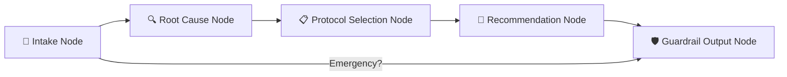

# 🌊 NatureCure AI — Phase 1 Naturopathy MVP Walkthrough

## What Was Built

Phase 1 of the **Holistic Health Triage Agent** — the **Naturopathy system** — is fully scaffolded with a working backend, frontend, knowledge base, guardrails, and eval suite.

---

## 🐍 Backend (FastAPI + LangGraph)

### Architecture: 5-Node LangGraph Agent Pipeline



> When a patient submits symptoms, the agent walks them through a multi-turn interview, analyzes root causes via Gemini LLM, matches them against the knowledge base, and generates a structured 30-day Nature Cure protocol.

---

### Files Created

#### Core App
| File | Purpose |
|------|---------|
| [main.py](file:///e:/Prashant/AI/development/holistic-treatment-agent/backend/main.py) | FastAPI entrypoint with 5 routes |
| [config.py](file:///e:/Prashant/AI/development/holistic-treatment-agent/backend/config.py) | Pydantic Settings (env vars, Gemini config) |
| [requirements.txt](file:///e:/Prashant/AI/development/holistic-treatment-agent/backend/requirements.txt) | Python deps (FastAPI, LangGraph, LangChain, Gemini, SQLAlchemy, Redis, DeepEval) |
| [.env](file:///e:/Prashant/AI/development/holistic-treatment-agent/backend/.env) | ⚠️ **Needs your `GEMINI_API_KEY`** |

#### LangGraph Naturopathy Agent (`backend/naturopathy/`)
| File | Purpose |
|------|---------|
| [state.py](file:///e:/Prashant/AI/development/holistic-treatment-agent/backend/naturopathy/state.py) | `NaturopathyState` TypedDict — all session data fields (patient info, symptoms, root causes, protocols, flags) |
| [prompts.py](file:///e:/Prashant/AI/development/holistic-treatment-agent/backend/naturopathy/prompts.py) | System prompt (Nature Cure principles) + node-specific prompts for intake, root cause analysis, protocol selection, recommendations |
| [schemas.py](file:///e:/Prashant/AI/development/holistic-treatment-agent/backend/naturopathy/schemas.py) | Pydantic models: `PatientInfo`, `SymptomInput`, `ChatRequest`, `AssessmentResponse`, `RootCause`, `Protocol`, `NaturopathyReport` |
| [nodes.py](file:///e:/Prashant/AI/development/holistic-treatment-agent/backend/naturopathy/nodes.py) | 5 node functions that call Gemini via LangChain: `intake_node` → `root_cause_node` → `protocol_selection_node` → `recommendation_node` → `guardrail_output_node` |
| [graph.py](file:///e:/Prashant/AI/development/holistic-treatment-agent/backend/naturopathy/graph.py) | LangGraph `StateGraph` wiring — conditional edges for emergency short-circuit, linear flow for normal assessment |
| [agent.py](file:///e:/Prashant/AI/development/holistic-treatment-agent/backend/naturopathy/agent.py) | `NaturopathyAgent` class — clean interface with `start_session()`, `process_message()`, `get_session_response()` |

#### How the 5 Nodes Work

| Node | What It Does |
|------|-------------|
| **`intake_node`** | Progressively asks 8+ questions about chief complaint, diet, sleep, stress, exercise, water intake, emotional state, occupation. Uses Gemini to generate natural conversational questions. |
| **`root_cause_node`** | Sends all collected patient data to Gemini with a root-cause analysis prompt. Extracts structured causes categorized as Dietary / Lifestyle / Emotional / Environmental / Structural, each with severity ratings. |
| **`protocol_selection_node`** | Loads all 5 JSON knowledge base files, matches root cause categories to Nature Cure protocols, and calls Gemini to select the most relevant treatments. |
| **`recommendation_node`** | Synthesizes everything into a structured 30-day report: daily routine, diet do's/don'ts, specific exercises, hydrotherapy schedule, herbs, and red flags. |
| **`guardrail_output_node`** | Checks for emergency keywords, counts severe root causes (>3 → practitioner routing), appends AYUSH disclaimer to all outputs. |

---

#### Guardrails (`backend/guardrails/`)
| File | Purpose |
|------|---------|
| [input_guardrails.py](file:///e:/Prashant/AI/development/holistic-treatment-agent/backend/guardrails/input_guardrails.py) | Emergency keyword detector (30+ keywords: cardiac, breathing, poisoning, suicide, etc.), scope limiter (blocks non-health queries), pediatric router (age <5), pregnancy flag |
| [output_guardrails.py](file:///e:/Prashant/AI/development/holistic-treatment-agent/backend/guardrails/output_guardrails.py) | Allopathic drug prescribing block (detects if LLM tries to prescribe antibiotics/steroids/etc.), AYUSH disclaimer auto-injector, practitioner routing logic |

---

#### Knowledge Base (`backend/knowledge_base/`) — ~87KB of curated data
| File | Size | Contents |
|------|------|----------|
| [naturopathy_protocols.json](file:///e:/Prashant/AI/development/holistic-treatment-agent/backend/knowledge_base/naturopathy_protocols.json) | 40KB | **15 condition protocols** (chronic fatigue, digestive disorders, eczema, respiratory, metabolic syndrome, hypertension, joint pain, anxiety, insomnia, migraines, hormonal imbalance, liver, kidney, immunity, anemia) — each with diet therapy, hydrotherapy, yoga, mud/sun therapy, herbs, and timelines |
| [diet_therapy.json](file:///e:/Prashant/AI/development/holistic-treatment-agent/backend/knowledge_base/diet_therapy.json) | 11KB | Fasting protocols (intermittent, juice, water, mono-diet), therapeutic diets (raw food, sattvic, alkaline, anti-inflammatory), healing juice recipes, food classifications (sattvic/rajasic/tamasic) |
| [hydrotherapy.json](file:///e:/Prashant/AI/development/holistic-treatment-agent/backend/knowledge_base/hydrotherapy.json) | 11KB | Cold/hot applications, contrast baths, wet sheet packs, enema protocols, condition-specific protocols (fever, constipation, joint pain, headache, insomnia, skin, respiratory) |
| [detox_protocols.json](file:///e:/Prashant/AI/development/holistic-treatment-agent/backend/knowledge_base/detox_protocols.json) | 6KB | Liver cleanse, colon cleanse, kidney flush, lymphatic cleanse, skin detox — with seasonal detox plans |
| [herb_drug_interactions.json](file:///e:/Prashant/AI/development/holistic-treatment-agent/backend/knowledge_base/herb_drug_interactions.json) | 19KB | **20+ herbs** (Ashwagandha, Turmeric, Neem, Tulsi, Triphala, Brahmi, etc.) with drug interaction data (blood thinners, diabetes meds, thyroid meds, BP meds, immunosuppressants), pregnancy/pediatric unsafe herbs |

---

#### Memory & Persistence (`backend/memory/`)
| File | Purpose |
|------|---------|
| [session_store.py](file:///e:/Prashant/AI/development/holistic-treatment-agent/backend/memory/session_store.py) | Redis-backed session store with automatic in-memory dict fallback if Redis is unavailable. Stores full LangGraph state per session with 1-hour TTL. |
| [patient_profile.py](file:///e:/Prashant/AI/development/holistic-treatment-agent/backend/memory/patient_profile.py) | SQLAlchemy models for PostgreSQL: `PatientProfile` and `ConsultationSession` tables. Gracefully degrades if PostgreSQL is not running (app starts with a warning). |

---

#### Eval Suite (`backend/evals/`)
| File | Purpose |
|------|---------|
| [test_naturopathy_evals.py](file:///e:/Prashant/AI/development/holistic-treatment-agent/backend/evals/test_naturopathy_evals.py) | **13 tests** using DeepEval + pytest: emergency detection (12 cases), false positive check, allopathic leakage detection, AYUSH disclaimer injection, knowledge base integrity validation (all 5 JSON files) |
| [test_cases/naturopathy_cases.json](file:///e:/Prashant/AI/development/holistic-treatment-agent/backend/evals/test_cases/naturopathy_cases.json) | **8 labelled test cases** covering: chronic fatigue, digestive disorder, emergency (chest pain), skin condition, insomnia, adversarial allopathic request, hypertension, pediatric routing |

> **Last eval run**: **13/13 tests passed** ✅

---

#### API Endpoints
| Method | Endpoint | Description |
|--------|----------|-------------|
| `POST` | `/api/naturo/start` | Start new session (body: `SymptomInput` with patient info + initial message) |
| `POST` | `/api/naturo/chat` | Send message in existing session (body: `ChatRequest` with session_id + message) |
| `GET` | `/api/session/{id}` | Get current session state |
| `DELETE` | `/api/session/{id}` | Clear session |
| `GET` | `/health` | Health check |
| `GET` | `/docs` | Swagger UI (auto-generated) |

---

## 🎨 Frontend (Next.js 15)

### Design
- **Color palette**: Deep forest green (#1a3a2a), warm cream (#f5f0e8), earthy brown, soft sage, gold accents
- **Typography**: Cormorant Garamond (headings) + Inter (body)
- **Effects**: Glassmorphism cards, fade-in animations, animated typing indicators

### Components

| File | Purpose |
|------|---------|
| [globals.css](file:///e:/Prashant/AI/development/holistic-treatment-agent/frontend/src/app/globals.css) | Full design system — CSS variables, glassmorphism utilities (`.glass-card`, `.glass-light`), button styles, keyframe animations (`fadeInUp`, `slideInRight`, `pulse-green`, `typing-dot`), custom scrollbar |
| [layout.js](file:///e:/Prashant/AI/development/holistic-treatment-agent/frontend/src/app/layout.js) | Root layout with Google Fonts + SEO meta (title: "NatureCure AI — Holistic Naturopathy Advisor") |
| [page.js](file:///e:/Prashant/AI/development/holistic-treatment-agent/frontend/src/app/page.js) | Main page — toggles between HeroSection (landing) and ChatInterface (assessment) |
| [HeroSection.jsx](file:///e:/Prashant/AI/development/holistic-treatment-agent/frontend/src/components/HeroSection.jsx) | Full-screen hero with forest green gradient, patient info form (name/age/gender/region), animated feature pills, "Begin Your Assessment" CTA, AYUSH disclaimer |
| [ChatInterface.jsx](file:///e:/Prashant/AI/development/holistic-treatment-agent/frontend/src/components/ChatInterface.jsx) | Main chat UI — sidebar with progress steps, scrollable message bubbles (gold for user, glass for AI), typing indicator, input bar with Send button. Displays `RecommendationCard` when assessment completes |
| [AssessmentProgress.jsx](file:///e:/Prashant/AI/development/holistic-treatment-agent/frontend/src/components/AssessmentProgress.jsx) | Sidebar progress tracker: Intake → Root Cause → Protocol Design → Your Protocol (animated step transitions with checkmarks) |
| [RecommendationCard.jsx](file:///e:/Prashant/AI/development/holistic-treatment-agent/frontend/src/components/RecommendationCard.jsx) | Structured report card with tabs: Root Causes, 30-Day Protocol, Diet, Hydrotherapy, Exercise, Herbs, Red Flags |
| [SafetyAlert.jsx](file:///e:/Prashant/AI/development/holistic-treatment-agent/frontend/src/components/SafetyAlert.jsx) | Alert banners: 🚨 Emergency (red), 🏥 Practitioner routing (orange), ⚠️ Herb-drug warning (yellow), ℹ️ Scope decline (blue) |
| [api.js](file:///e:/Prashant/AI/development/holistic-treatment-agent/frontend/src/services/api.js) | API service with `startSession()`, `sendMessage()`, `getSession()` — includes mock fallback if backend is down |

---

## ✅ Verified Working

| Check | Status |
|-------|--------|
| All backend imports (`graph`, `agent`, `guardrails`, `session_store`) | ✅ |
| Safety eval suite (13/13 tests) | ✅ |
| Backend starts with `python -m uvicorn main:app --reload --port 8000` | ✅ |
| Backend `/health` returns `{"status": "ok"}` | ✅ |
| PostgreSQL graceful degradation (app runs without Postgres) | ✅ |
| Redis graceful degradation (falls back to in-memory dict) | ✅ |
| Frontend starts with `npm run dev` on port 3000 | ✅ |
| npm packages installed (Next.js 15, framer-motion, lucide-react) | ✅ |
| pip packages installed (FastAPI, LangGraph, Gemini, Pydantic, SQLAlchemy, Redis, DeepEval) | ✅ |

---

## ⚠️ To Get It Running

```bash
# 1. Add your Gemini API key
# Edit backend/.env and set: GEMINI_API_KEY=your_key_here

# 2. Start backend (Terminal 1)
cd e:\Prashant\AI\development\holistic-treatment-agent\backend
python -m uvicorn main:app --reload --port 8000

# 3. Start frontend (Terminal 2)
cd e:\Prashant\AI\development\holistic-treatment-agent\frontend
npm run dev

# 4. Open http://localhost:3000
```

## 🚧 What's NOT Done Yet (Phase 2+)

- Ayurveda module (Prakriti assessment, dosha analysis)
- Homeopathy module (repertorization, materia medica)
- ChromaDB/Weaviate RAG (currently uses JSON knowledge base)
- Multi-language support (Hindi, Marathi, etc.)
- WhatsApp integration
- ABDM (Ayushman Bharat) integration
- Telemedicine practitioner routing
- Full observability (LangSmith, Prometheus, Grafana)
