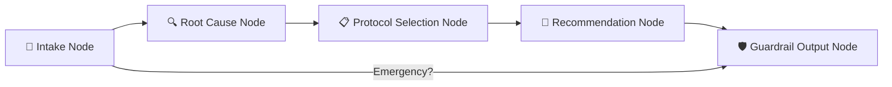

# 🌊 NatureCure AI — Project Walkthrough

## What Was Built

A full-stack **Holistic Health Triage Agent** with a Naturopathy-focused AI backend, a patient-facing chat UI, and a practitioner admin console.

---

## 🐍 Backend (FastAPI + LangGraph)

### Agent Pipeline (5-Node LangGraph Graph)



| Node | Purpose |
|------|---------|
| **intake_node** | Progressive 8+ question interview (chief complaint, diet, sleep, stress, exercise, etc.) via Gemini |
| **root_cause_node** | Analyzes all patient data → structured root causes categorized by Dietary / Lifestyle / Emotional / Environmental / Structural |
| **protocol_selection_node** | Matches root causes against Nature Cure protocols via RAG (Qdrant) + Gemini |
| **recommendation_node** | Generates structured 30-day report (daily routine, diet, exercises, herbs, red flags) |
| **guardrail_output_node** | Safety checks, allopathic drug blocking, AYUSH disclaimer injection, practitioner routing (>3 severe causes) |

---

### Backend Directory Structure

| Directory / File | Purpose |
|-----------------|---------|
| `main.py` | FastAPI entrypoint, patient-facing API routes |
| `config.py` | Pydantic Settings (env vars, Gemini, DB config) |
| `naturopathy/` | LangGraph agent — `state.py`, `prompts.py`, `schemas.py`, `nodes.py`, `graph.py`, `agent.py` |
| `admin/router.py` | Practitioner console APIs — pending cases, approvals, AI prescription, templates, RAG doc management |
| `auth/` | User authentication — signup, login, logout, JWT via HTTP-only cookies |
| `guardrails/` | Input guardrails (emergency, scope, pediatric, pregnancy) + Output guardrails (allopathic block, AYUSH disclaimer) |
| `memory/` | `session_store.py` (Redis + in-memory fallback), `patient_profile.py` (SQLAlchemy models) |
| `database/` | `models.py` — SQLAlchemy models: `User`, `PatientProfile`, `ConsultationSession`, `PrescriptionTemplate` |
| `rag/` | Qdrant vector DB integration for document embeddings and semantic search |
| `evals/` | DeepEval + pytest safety test suite (13 tests) |
| `tests/` | Unit tests (e.g., `test_ai_prescription.py` for prompt validation) |
| `scripts/` | Utility scripts (e.g., `seed_fake_cases.py` for dev data) |

---

### API Endpoints

#### Patient APIs (`main.py`)

| Method | Endpoint | Description |
|--------|----------|-------------|
| `POST` | `/api/naturo/start` | Start new session with patient info |
| `POST` | `/api/naturo/chat` | Send message in existing session |
| `POST` | `/api/naturo/chat_stream` | SSE streaming chat response |
| `POST` | `/api/naturo/submit_intake` | Submit collected intake data |
| `GET` | `/api/naturo/history` | Get patient's consultation history |
| `GET` | `/api/naturo/cases/{id}` | Get specific case details |
| `DELETE` | `/api/naturo/cases/{id}` | Delete a patient case |
| `GET` | `/api/session/{id}` | Get current session state |
| `DELETE` | `/api/session/{id}` | Clear session |
| `GET` | `/health` | Health check |

#### Auth APIs (`auth/router.py`)

| Method | Endpoint | Description |
|--------|----------|-------------|
| `POST` | `/api/auth/signup` | User registration |
| `POST` | `/api/auth/login` | Login (returns HTTP-only cookie) |
| `POST` | `/api/auth/logout` | Logout |
| `GET` | `/api/auth/me` | Get current user info |

#### Admin / Practitioner APIs (`admin/router.py`)

| Method | Endpoint | Description |
|--------|----------|-------------|
| `POST` | `/api/admin/login` | Admin login |
| `GET` | `/api/admin/pending-cases` | List cases awaiting review |
| `GET` | `/api/admin/cases/{id}` | Get full case details |
| `POST` | `/api/admin/cases/{id}/approve` | Approve & email prescription |
| `POST` | `/api/admin/cases/{id}/draft` | Save prescription draft |
| `POST` | `/api/admin/cases/{id}/generate-ai-prescription` | AI-generate prescription from doctor prompt |
| `GET/POST/PUT/DELETE` | `/api/admin/templates` | CRUD for prescription templates |
| `POST` | `/api/admin/upload` | Upload RAG document |
| `DELETE` | `/api/admin/docs/{filename}` | Delete RAG document |
| `GET` | `/api/admin/ingest/{filename}` | Ingest document into vector DB |
| `GET` | `/api/admin/embeddings/search` | Semantic search |
| `GET` | `/api/admin/embeddings/search-with-answer` | RAG search + LLM answer |

---

## 🎨 Frontend (Next.js 15)

### Design System
- **Palette**: Forest green (#1a3a2a), warm cream (#f5f0e8), earthy brown, sage, gold accents
- **Typography**: Cormorant Garamond (headings) + Inter (body)
- **Effects**: Glassmorphism cards, Framer Motion animations, typing indicators

### Components

| File | Purpose |
|------|---------|
| `HeroSection.jsx` | Landing page with patient info form and "Begin Assessment" CTA |
| `AuthModal.jsx` | Login / Signup modal with tab switching |
| `PatientFormModal.jsx` | Patient details form (name, age, gender, region, investigations) |
| `ChatInterface.jsx` | Main chat UI with progress sidebar, message bubbles, streaming support, mode switch detection |
| `AssessmentProgress.jsx` | Sidebar progress tracker (Intake → Root Cause → Protocol → Complete) |
| `RecommendationCard.jsx` | Structured 30-day protocol report with tabbed sections |
| `SafetyAlert.jsx` | Alert banners for emergencies, practitioner routing, herb-drug warnings |
| `Loader.jsx` | Loading spinner component |
| `admin/AdminDashboard.jsx` | Practitioner console — pending cases sidebar, prescription editor, AI generation, draft saving, preview modal, template management |
| `services/api.js` | API client with mock fallback for all patient, auth, and admin endpoints |

---

## ✅ Verified Working

| Check | Status |
|-------|--------|
| Backend starts on port 8080 (`uvicorn main:app`) | ✅ |
| Frontend starts on port 3000 (`npm run dev`) | ✅ |
| Safety eval suite (13/13 tests) | ✅ |
| PostgreSQL graceful degradation (runs without Postgres) | ✅ |
| Redis graceful degradation (falls back to in-memory dict) | ✅ |
| Patient auth flow (signup → login → session) | ✅ |
| Admin practitioner console (pending cases → AI rx → approve) | ✅ |

---

## ⚠️ To Get It Running

```bash
# 1. Add your Gemini API key
# Edit backend/.env and set: GEMINI_API_KEY=your_key_here

# 2. Start backend (Terminal 1)
cd backend
python -m uvicorn main:app --reload --port 8080

# 3. Start frontend (Terminal 2)
cd frontend
npm run dev

# 4. Open http://localhost:3000
```

---

## 🚧 What's NOT Done Yet (Phase 2+)

- Ayurveda module (Prakriti assessment, dosha analysis)
- Homeopathy module (repertorization, materia medica)
- Multi-language support (Hindi, Marathi, etc.)
- WhatsApp integration
- ABDM (Ayushman Bharat) integration
- Telemedicine practitioner routing
- Full observability (LangSmith, Prometheus, Grafana)
