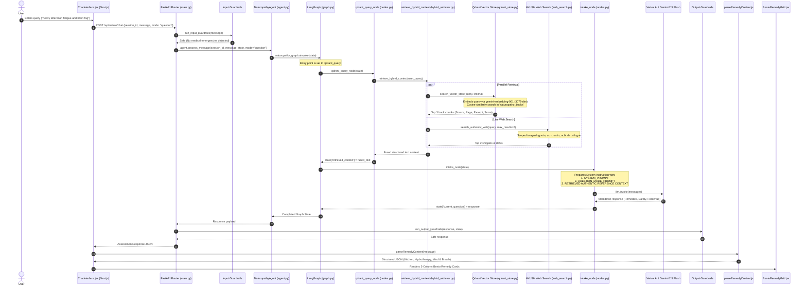
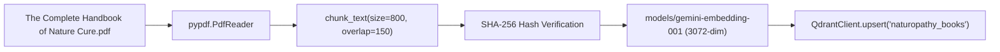

# Query Mode & Hybrid RAG Architecture — Low-Level Deep Dive

This document provides a comprehensive, low-level technical explanation of how **Query Mode** (Question Mode) operates within NatureCure AI (`holistic-treatment-agent`). It details how user queries flow through FastAPI, input guardrails, LangGraph, the Qdrant vector database (RAG over ingested Naturopathy literature), live AYUSH web search, Gemini 2.5 Flash synthesis, output guardrails, and frontend Bento Card rendering.

---

## 1. Architectural Overview

NatureCure AI does **not** rely solely on live web searches, nor does it hallucinate remedies purely from base LLM weights. It employs a **Hybrid Retrieval Architecture**:

1. **Local Domain Knowledge Base (Qdrant Vector Database)**:
   - Embedded book: *The Complete Handbook of Nature Cure (5th Edition)* by Dr. H.K. Bakhru (stored in `backend/data/docs/`).
   - Chunks (800 chars, 150 overlap) embedded into **3072-dimensional dense vectors** via `models/gemini-embedding-001`.
   - Stored in the local embedded Qdrant instance at `backend/data/qdrant_db` under the collection `naturopathy_books`.
2. **Live Domain-Restricted Web Search (DuckDuckGo)**:
   - Scoped strictly to authoritative AYUSH and medical research domains (`ayush.gov.in`, `ninpune.ayush.gov.in`, `ccrn.res.in`, `ncbi.nlm.nih.gov`).
3. **Context Fusion Engine**:
   - Merges vector results and web snippets into a unified reference context block injected into Gemini's system instructions before generating remedies.

---

## 2. End-to-End Sequence Diagram



---

## 3. Step-by-Step Execution Lifecycle

### Step 1: Frontend Request Dispatch
When a visitor or logged-in patient types a question in the chat interface:
- **File**: `frontend/src/components/ChatInterface.jsx`
- **Method**: Dispatches `POST /api/naturo/chat` (or `/api/naturo/start` for the opening prompt).
- **Payload**:
  ```json
  {
    "session_id": "733b1a52-c7f4-4bde-81d8-9dee20e74ca2",
    "message": "I experience heavy afternoon fatigue and brain fog. What natural diet and routine do you recommend?",
    "mode": "question"
  }
  ```

---

### Step 2: API Ingestion & Input Guardrails
- **File**: `backend/main.py` & `backend/guardrails/input_guardrails.py`
- `main.py::chat()` receives the request.
- `run_input_guardrails(request.message)` analyzes the text for emergency keywords (chest pain, stroke, suicidal ideation, uncontrollable bleeding, etc.).
- If an emergency is detected, it terminates the request immediately with an emergency hotline referral (112 / 911) without calling the LLM.
- If safe, it passes state to `agent.process_message(...)`.

---

### Step 3: LangGraph Execution & Entry Point Routing
- **Files**: `backend/naturopathy/agent.py` & `backend/naturopathy/graph.py`
- The state graph compiles with `qdrant_query` explicitly registered as the **entry point**:
  ```python
  # backend/naturopathy/graph.py
  graph.set_entry_point('qdrant_query')
  graph.add_edge('qdrant_query', 'intake')
  ```
- This guarantees that **every single message**, whether in Query Mode or Treatment Mode, queries the vector store and live web before the LLM generates a response.

---

### Step 4: Hybrid Retrieval Engine
- **File**: `backend/rag/hybrid_retriever.py`
- The node `qdrant_query_node` extracts the latest user question and invokes `retrieve_hybrid_context(user_query)`:

```python
@lru_cache(maxsize=128)
def retrieve_hybrid_context(user_query: str) -> Dict[str, Any]:
    # 1. Vector Search in Qdrant (Book chunks)
    vector_results = search_vector_store(user_query, limit=3)

    # 2. Live Web Search (AYUSH / PubMed references)
    web_results = search_authentic_web(user_query, max_results=2)
```

#### A. Vector Search in Qdrant (`backend/rag/qdrant_store.py`)
1. Generates dense query vector using `models/gemini-embedding-001`:
   - Dimension: **3072 floats**.
   - Authenticated directly via `GEMINI_API_KEY` (Google AI Studio Developer API, as `gemini-embedding-001` is not available on Vertex AI).
2. Connects to Qdrant:
   - Local embedded database stored on disk at `backend/data/qdrant_db`.
   - Collection name: `naturopathy_books`.
3. Performs Cosine Similarity search retrieving top `limit=3` chunks.
4. Each chunk payload includes:
   - `text`: The raw text excerpt from the book.
   - `source`: `"The Complete Handbook of Nature Cure (5th Edition).pdf"`.
   - `page`: Exact page number in the published volume.
   - `title`: Chapter/Subject heading.
   - `score`: Cosine similarity score (typically 0.65 – 0.88).

#### B. Authentic Web Search (`backend/rag/web_search.py`)
1. Reads approved domains from `backend/resources.yaml`:
   - `ayush.gov.in`
   - `ninpune.ayush.gov.in`
   - `ccrn.res.in`
   - `ncbi.nlm.nih.gov`
2. Constructs a scoped DuckDuckGo query:
   ```text
   (site:ayush.gov.in OR site:ninpune.ayush.gov.in OR site:ccrn.res.in OR site:ncbi.nlm.nih.gov) naturopathy fatigue and brain fog
   ```
3. If the scoped search yields zero results, it executes a fallback query:
   ```text
   naturopathy nature cure AYUSH fatigue and brain fog
   ```
4. Returns up to 2 snippets with titles and source URLs.

#### C. Context Structuring
Both retrieval streams are combined into a clean, labeled reference block:
```text
=== REFERENCE BOOKS & PROTOCOLS (Qdrant Vector DB) ===
[1] Source: The Complete Handbook Of Nature Cure (5Th Edition) (Page 142)
Excerpt: Hydrotherapy for Fatigue: A cold friction bath upon rising stimulates the nervous system...

[2] Source: The Complete Handbook Of Nature Cure (5Th Edition) (Page 210)
Excerpt: Dietetic Treatment of Brain Fog: Eliminate refined starches and heavy noon meals...

=== AUTHENTIC LIVE WEB REFERENCES (AYUSH / PubMed) ===
[1] Title: Clinical Naturopathy Protocols — National Institute of Naturopathy (NIN Pune)
URL: https://ninpune.ayush.gov.in/protocols
Snippet: Guidelines on circadian meal timing and pranayama for mental fatigue...
```

---

### Step 5: Gemini LLM Synthesis (`intake_node`)
- **File**: `backend/naturopathy/nodes.py`
- The combined text is injected into the Gemini context:

```python
system_instruction = (
    SYSTEM_PROMPT + "\n\n" +
    QUESTION_MODE_PROMPT + "\n\n" +
    f"RETRIEVED AUTHENTIC REFERENCE CONTEXT:\n{retrieved_context}"
)
```

- **Model**: `gemini-2.5-flash` via Vertex AI (ADC credentials) or Gemini API key.
- **Parameters**: `temperature=0.3`, `max_tokens=8192`.
- **Formatting Instructions (`QUESTION_MODE_PROMPT`)**:
  - Requires instant, actionable relief grouped by Naturopathic modalities (Kitchen Pharmacy, Hydrotherapy, Mind & Breath).
  - Evaluates symptom severity; appends `[MODE: treatment]` if chronic/complex, or `[MODE: question]` if simple.
  - Prohibits hallucinating allopathic drug prescriptions or chemical interventions.

---

### Step 6: Post-Processing & Output Guardrails
- **File**: `backend/guardrails/output_guardrails.py`
- Validates the model output:
  - Ensures no pharmaceutical drug names are prescribed.
  - Verifies presence of mandatory AYUSH disclaimer.
  - Strips internal routing tags (e.g. `[MODE: treatment]`) and sets `recommended_mode = "treatment"` in the structured JSON state.
- Saves the updated state into `backend/memory/session_store.py`.

---

### Step 7: Frontend Bento Card Parsing & Rendering
- **Files**: `frontend/src/utils/parseRemedyContent.js` & `frontend/src/components/BentoRemedyGrid.jsx`
- The frontend receives the response and parses it into 3 modular cards:
  1. **🍵 Kitchen Pharmacy**: Diet guidelines, herbal infusions, and food timing.
  2. **💧 Hydrotherapy**: Water temperature protocols (e.g. cold friction bath, warm foot bath, hydration schedule).
  3. **🧘 Mind & Breath**: Yogic breathing techniques (4-7-8, Nadi Shodhana), meditation, and circadian sleep habits.
- Renders the **5 Elements Pills** (Akash, Vayu, Agni, Jal, Prithvi) and an inline safety notice strip.

---

## 4. How the Book was Ingested into Qdrant

The document ingestion pipeline is defined in `backend/ingest_docs.py`:



1. **File Location**: `backend/data/docs/The Complete Handbook of Nature Cure (5th Edition).pdf` (7.1 MB).
2. **Chunking Parameters**:
   - `chunk_size = 800` characters.
   - `overlap = 150` characters.
3. **Metadata Stored per Point**:
   ```json
   {
     "text": "...chunk text...",
     "source": "The Complete Handbook of Nature Cure (5th Edition).pdf",
     "page": 42,
     "title": "The Complete Handbook Of Nature Cure (5Th Edition)",
     "category": "naturopathy_book",
     "file_hash": "...",
     "doc_id": "..."
   }
   ```
4. **Idempotency**: `ingest_docs.py` calculates the SHA-256 hash of the PDF. If the document already exists in Qdrant with an identical hash, ingestion is skipped to conserve API quota.

---

## 5. Configuration & Control Toggles

The retrieval behavior can be adjusted in `backend/.env`:

| Environment Variable | Default | Description |
|---|:---:|---|
| `QDRANT_COLLECTION` | `naturopathy_books` | Target Qdrant collection name for book embeddings. |
| `QDRANT_URL` | `""` *(empty = local disk)* | Set to remote Qdrant Cloud URL or `http://localhost:6333` if running Qdrant via Docker. |
| `DISABLE_WEB_SEARCH` | `false` | When set to `true`, shuts off DuckDuckGo live search, forcing the agent to rely **100% on Qdrant book chunks**. |
| `GEMINI_MODEL` | `gemini-2.5-flash` | The generation model invoked for response synthesis. |
| `CACHE_LLM` | `true` | Caches identical LLM prompt calls via Redis (or in-memory fallback). |

---

## 6. Live Verification in Logs

To observe the RAG retrieval pipeline live, run the backend and watch the terminal logs:

```text
2026-09-11 16:34:00 [INFO] rag.hybrid_retriever: Retrieving hybrid context for query: 'I experience heavy afternoon fatigue and brain fog...'
2026-09-11 16:34:00 [INFO] rag.qdrant_store: {"event": "qdrant_search", "collection": "naturopathy_books", "query": "I experience heavy afternoon fatigue...", "k": 3, "hits": 3, "latency_ms": 142}
2026-09-11 16:34:01 [INFO] rag.web_search: Executing authentic web search: 'I experience heavy afternoon fatigue...'
2026-09-11 16:34:02 [INFO] rag.web_search: Retrieved 2 web search results.
2026-09-11 16:34:02 [INFO] naturopathy.nodes: DEBUG LLM OUTPUT (Question Mode): 🌿 **Instant Nature Cure Remedies**...
```

---

## 7. Key Takeaway Summary

- **Is the system only calling external websites?** No. It queries your local Qdrant vector database first on every single turn.
- **Is it referring to RAG?** Yes. Top 3 semantic chunks from *The Complete Handbook of Nature Cure* are retrieved, scored, and injected into the prompt.
- **Can it run completely offline / local RAG only?** Yes, by setting `DISABLE_WEB_SEARCH=true` in `backend/.env`.
