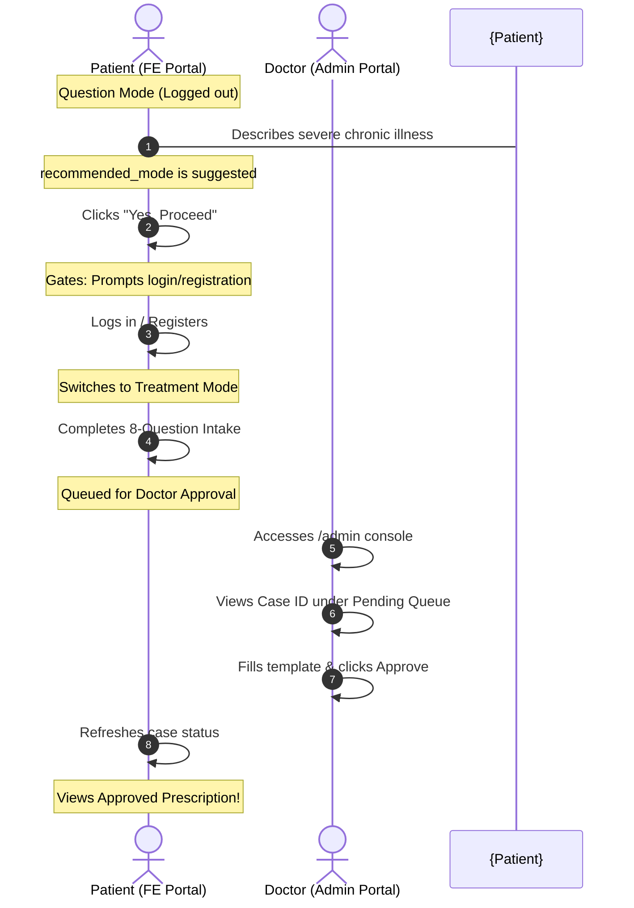

# Treatment Mode & Practitioner Dashboard E2E Testing Playbook

This document outlines the step-by-step procedure to test the dual-mode treatment intake, login gating, practitioner review console, and patient prescription rendering workflows.

You can verify this flow either **manually** in the browser or **automatically** using Playwright.

---

## Prerequisites

Ensure both backend and frontend servers are running:

### 1. Start Backend Server (Port 8080)
Ensure Python virtual environment is activated and run:
```powershell
cd backend
python -m uvicorn main:app --port 8080 --host 127.0.0.1
```
Check status: `http://localhost:8080/health` should return `{"status": "ok"}`.

### 2. Start Frontend Server (Port 3000)
Run in another terminal:
```powershell
cd frontend
npm run dev
```
Open `http://localhost:3000` to access the application.

---

## Flow Diagram



---

## Manual Verification Steps

Follow these sequential steps to test the entire client lifecycle:

### Step 1: Initiate Patient Session (Question Mode)
1. Navigate to the Patient Portal at `http://localhost:3000`.
2. Click the **"Start Journey"** button.
3. Fill out the demographics modal:
   - **Name**: `John Doe`
   - **Age**: `45`
   - **Gender**: `Male`
   - **Region**: `India`
4. Click **"Begin your assessment"**. The chat session initializes in **Question Mode** with a welcome message.

### Step 2: Trigger Treatment Mode Suggestion
1. Type a chronic or severe symptom in the input field:
   > *"I have had severe autoimmune Hashimoto thyroiditis for 5 years with extreme chronic exhaustion and constant fatigue"*
2. Press **Enter** to send.
3. The AI agent analyzes the complexity, determines that a structured intake is necessary, and displays a card proposing:
   * **"Treatment Mode Suggested"**

### Step 3: Login Gating & Authentication
1. Click **"Yes, Proceed"** on the switch recommendation card.
2. Since you are not logged in, the **AuthModal** will intercept and open automatically.
3. Click the **"Switch to Register"** link at the bottom of the modal.
4. Input details:
   - **Name**: `John Doe`
   - **Email**: `john.doe@example.com` (must be unique)
   - **Password**: `securepassword123`
5. Click **"Register"**.
6. After registration, the system authenticates the user and displays the confirmation prompt overlay:
   * **"Treatment Mode has been suggested to you. Do you want to proceed?"**
7. Click **"Yes, Proceed"**.

### Step 4: Complete the Intake Flow
1. The chat switches to **Treatment Mode**.
2. Notice the sidebar progress tracker (`AssessmentProgress`) highlights **"Intake Assessment"**.
3. Answer the subsequent 8 questions sequentially.
4. Once the 8th question is answered:
   - The backend locks the session state.
   - The UI renders the **"Intake Complete - Pending Review"** card.
   - Keep note of the unique **Case ID** (e.g. `case_...` or Session ID) displayed on this card.

### Step 5: Admin / Practitioner Review Console
1. Open a new tab and navigate to the Admin Dashboard at `http://localhost:3000/admin`.
2. Enter the credential details:
   - **Username**: `admin`
   - **Password**: `admin`
3. Click **"Login"**.
4. Go to the **"Practitioner Console"** tab (next to "RAG Knowledge Base").
5. You will see the Case ID corresponding to `John Doe` in the **Pending Queue**.
6. Click the case to load the detail panel:
   - View demographic details (Name, Age, Gender, Region).
   - Read the complete **Chat Transcript**.
   - Review the **AI-generated Analysis Summary**.

### Step 6: Prescription Approval
1. Under the prescription section, click the **"Chronic Fatigue"** template shortcut button.
2. The protocol input fields (Recommended Protocols, Safety Precautions, Doctor Notes) will automatically populate with standard Naturopathy guidelines.
3. Click **"Approve & Send Prescription"**.
4. The case is now approved and cleared from the practitioner queue.

### Step 7: View Approved Prescription
1. Return to the Patient Portal tab (`http://localhost:3000`).
2. On the pending review card, click **"Refresh Review Status"**.
3. The interface dynamically updates to render your **Official Naturopathy Prescription**:
   - Formatted protocols (duration, frequency, instructions).
   - Safety precautions and contraindications.
   - Practitioner notes.
   - A clickable **"Print Prescription"** button.

---

## Automated Verification (Playwright)

To verify the entire flow programmatically, you can run the pre-configured Playwright tests:

### Run Headless E2E Tests
To run all tests headlessly:
```powershell
cd frontend
npx playwright test
```

### Run Directed Practitioner Flow
To run only the practitioner E2E test file:
```powershell
cd frontend
npx playwright test playwright/practitioner.spec.js
```

### Run with Graphical UI Runner (Headed / Interactive)
To watch Playwright interact with the UI, fill inputs, log in, approve the prescription, and complete the sequence in real time:
```powershell
cd frontend
npx playwright test playwright/practitioner.spec.js --ui
```
*(Alternatively, use `npx playwright test playwright/practitioner.spec.js --ui` to launch a visible browser instance).*

---

## Severe Health Prompts for Testing

Here are 5 representative clinical prompts indicating severe/chronic health conditions that trigger the "Treatment Mode Suggested" triage card:

1. **Hashimoto's Autoimmune Flare**:
   > *"I have had severe autoimmune Hashimoto thyroiditis for 5 years with extreme chronic exhaustion and constant fatigue"*
2. **Chronic Inflammatory Bowel Disease (Ulcerative Colitis)**:
   > *"I have been diagnosed with chronic Ulcerative Colitis for the last 3 years, experiencing constant abdominal pain, weight loss, and frequent flare-ups"*
3. **Severe Chronic Rheumatoid Arthritis**:
   > *"I have severe Rheumatoid Arthritis in both my knees and wrists for 4 years, causing constant joint stiffness, inflammation, and inability to walk in the morning"*
4. **Chronic Fibromyalgia & Widespread Neuropathic Pain**:
   > *"I suffer from chronic Fibromyalgia for over 6 years with widespread muscle pain, sleep disturbances, and debilitating brain fog that prevents me from working"*
5. **Chronic Severe Type 2 Diabetes with Neuropathy**:
   > *"I have had Type 2 Diabetes for 8 years and I am now experiencing burning sensations in my feet and chronic poor circulation"*
