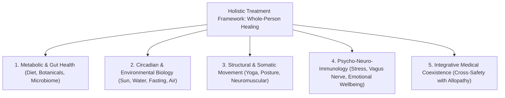

# Holistic Treatment vs. Naturopathy (BNYS): Strategic Comparison & Vision

This document details the strategic, clinical, and commercial differences between **Holistic Treatment** and **Naturopathy (BNYS)**, establishing the "Wedge Strategy" for independent and angel investors.

---

## 1. Core Differentiation: Philosophy vs. Regulated Medical Discipline

| Dimension | **Holistic Treatment** | **Phase 1: Naturopathy (BNYS)** |
| :--- | :--- | :--- |
| **Fundamental Nature** | A **philosophy and broad approach** to healthcare that treats the *whole person* (Mind, Body, Emotions, Environment, Social) rather than isolated symptoms. | A **specific, legally recognized clinical stream of medicine** governed under the Ministry of AYUSH in India. |
| **Medical Credential** | **None by itself.** There is no degree called "Bachelor of Holistic Medicine." It draws from multiple modalities (Naturopathy, Functional Medicine, Ayurveda, Nutrition, Psychology). | **BNYS** (Bachelor of Naturopathy & Yogic Sciences) — an intensive 5.5-year medical degree including 1 year of clinical internship. |
| **Legal Status** | An overarching wellness/healthcare framework. It cannot legally issue a regulated medical prescription or diagnostic order on its own. | Registered Medical Practitioners (RMPs) with state council and central NRB licensing, legally authorized to diagnose, prescribe, and certify. |
| **Consumer Perception** | Modern, premium, lifestyle-oriented ("Root-cause health", "Longevity", "Metabolic health"). High organic consumer search volume. | Often perceived as traditional nature cure, or conflated with luxury 7-15 day residential retreats (e.g., Jindal Naturecure, Kshemavana). |
| **Investor Risk** | **"The Wellness Trap"** — Risk of being seen as unscientific, vague, or cluttered with unregulated health influencers. | **"The Niche Trap"** — Defensible and clinical, but investors may worry the registered BNYS practitioner pool (~15,000–25,000) is a smaller TAM if restricted. |

---

## 2. The 5 Interconnected Dimensions of Holistic Treatment

When focusing on Holistic Treatment, the platform operates as a multi-dimensional health system:

1. **Metabolic & Gut Health (Biochemical Layer):** Therapeutic fasting, anti-inflammatory nutrition, elimination protocols, and targeted herbal/plant supplements to heal the gut lining, balance hormones, and reverse metabolic dysregulation.
2. **Circadian & Environmental Biology (Physical Layer):** Using nature's fundamental forces (morning sunlight for circadian alignment, thermal hydrotherapy, sleep hygiene, and clean air) to reset autonomic function.
3. **Movement & Somatic Alignment (Structural Layer):** Therapeutic yoga, corrective posture, and breathing mechanics (pranayama) to release chronic physical and neurological stress.
4. **Psycho-Neuro-Immunology (Mental & Emotional Layer):** Addressing the mind-body connection—specifically chronic stress, nervous system dysregulation, and burnout—which directly trigger physical inflammation.
5. **Integrative Medical Coexistence (Safety Layer):** Ensuring natural protocols harmonize safely with ongoing allopathic prescriptions (e.g., antihypertensives, insulin, thyroid medications) rather than dogmatically demanding patients quit essential drugs.

---

## 3. Commercial & Investor Implications

### Why the Holistic Framing Unlocks Greater Value
*   **Massive TAM:** The global wellness, longevity, and functional medicine market is estimated at **\$1.8 Trillion**. Modern urban consumers search for *"holistic treatment for PCOS"* or *"holistic gut reset"*, rather than clinical titles.
*   **Higher Lifetime Value (LTV):** Holistic healing is a continuous lifestyle journey rather than a one-time transactional visit. It lends itself naturally to recurring subscription models (e.g., monthly AI circadian coaching + quarterly clinical consultations).
*   **Expansion Runway:** A holistic data architecture allows you to easily add certified clinical nutritionists, Ayurvedic specialists (BAMS), and integrative functional medicine physicians in later phases without redesigning your brand.

---

## 4. The Recommended Investor Strategy: The "Wedge Strategy"

To maximize investor confidence, combine the commercial breadth of Holistic Treatment with the clinical credibility of BNYS Naturopathy:

> **Position the Brand as "Holistic Treatment" to the Consumer, but Anchor the Clinical Engine in "Evidence-Based BNYS Naturopathy" for Regulatory Defense.**

*   **The Consumer Front Door:** *"The AI-Native Platform for Evidence-Based Holistic Treatment."* (Broad appeal, high trust, premium market capture).
*   **The Engine Room (Phase 1):** *"Powered by Verified BNYS Physicians & Authorized Clinical Knowledge."* (Strict anti-quackery, legal prescription authority, clinical defensibility).
*   **The Investor Summary:**
    > *"Consumers want holistic, whole-person healthcare, but the market is flooded with unverified wellness influencers and unscientific advice. We provide **clinical-grade Holistic Treatment**—combining AI root-cause analysis with strictly verified medical practitioners. Naturopathy is our regulatory and clinical wedge in Phase 1; an intelligent, whole-person health operating system is our global destination."*
