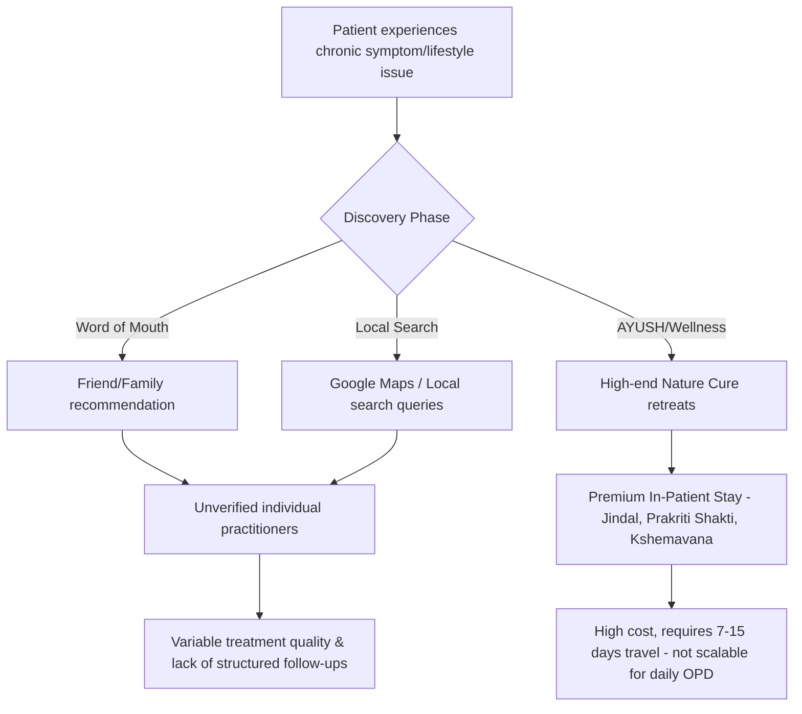

# Market Research: State of Naturopathy in India

This report provides data-driven insights and market validation for building a digital network/platform of verified naturopathy practitioners in India. It is structured to help you present a compelling business case to independent and angel investors.

---

## 1. Market Size & Growth Dynamics (The Macro Picture)

The Indian traditional and complementary medicine ecosystem (governed by the Ministry of AYUSH) is experiencing rapid commercialization and institutional support.

*   **AYUSH Sector Valuation:** The Indian AYUSH market is valued at approximately **\$23 Billion (2025/2026)**, representing massive growth from \$18.1 Billion in 2020. Economists project the broader market to hit \$200 Billion by 2030, driven by global wellness tourism, domestic insurance coverage integration, and preventive healthcare adoption.
*   **Yoga & Naturopathy Segment:** While Ayurveda remains the largest market segment (~70%), **Yoga & Naturopathy is the fastest-growing sub-sector**, registering a compound annual growth rate (**CAGR) of 14.79%** (projected through 2031).
*   **Key Growth Catalyst:** The rising burden of non-communicable lifestyle diseases (NCDs)—such as type-2 diabetes, hypertension, obesity, and mental stress—is driving consumers toward root-cause, side-effect-free preventive care rather than purely symptomatic management.

---

## 2. Consumer Beliefs & Adoption Statistics

To validate customer demand, we look at the official **NSSO 79th Round Survey (2022-2023)** released in June 2024 by the Ministry of Statistics and Programme Implementation (MoSPI). This was the first exclusive, nationwide survey tracking AYUSH usage:

| Metric | Urban India | Rural India | Key Takeaway |
| :--- | :---: | :---: | :--- |
| **Active Usage (Past Year)** | **53%** | **46%** | Roughly half of the Indian population actively used AYUSH treatments or preventive health protocols in the past 12 months. |
| **General Awareness** | **96%** | **95%** | Near-universal awareness of alternative medicine streams. |
| **Household Traditional Knowledge** | **86%** | **85%** | At least one member in almost 9 out of 10 Indian households is actively aware of and practices home remedies, local health traditions, or uses medicinal plants. |

### Consumer Trust Factors:
1.  **Zero Side Effects:** Naturopathy utilizes natural agents (water, mud, air, diet, and herbs), which eliminates the risk of drug-induced toxicity or side effects.
2.  **Affordability:** Naturopathy treatments are highly cost-effective compared to long-term chronic disease medication.
3.  **Chronic and Lifestyle Management:** Patients frequently transition to naturopathy when modern medicine only offers management (e.g., lifelong pills for thyroid or diabetes) instead of a cure.

---

## 3. Regulation, Licensing, and Credibility

One of the most critical questions investors will ask is: **"Who is a qualified naturopath doctor, and how do we ensure quality?"**

### The Academic Standard: BNYS
In India, a licensed naturopathy doctor must complete a **BNYS (Bachelor of Naturopathy and Yogic Sciences)** degree.
*   **Course Duration:** 5.5 years (4.5 years of academic study + 1 year of compulsory rotatory clinical internship).
*   **Curriculum:** Regulated heavily, covering modern anatomy, physiology, pathology, and clinical diagnostics alongside classical naturopathy therapies (hydrotherapy, mud therapy, dietetics, acupuncture, chromotherapy, and yoga therapy).
*   **Infrastructure:** There are between **70 to 102 BNYS colleges** across India, graduating approximately 4,000–6,000 doctors annually.

### Licensing & Registration Bodies
Unlike Ayurveda or Homeopathy, which have long-standing central councils, Naturopathy registration is governed via a hybrid model:
1.  **State AYUSH Councils:** Practitioners must register with their respective State Medical Boards (e.g., Karnataka Board of Ayurvedic and Unani Practitioners, Board of Indian Medicine, etc.) to legally practice as a Registered Medical Practitioner (RMP).
2.  **Central Registry (Naturopathy Registration Board - NRB):** Established under the **National Institute of Naturopathy (NIN)**, Ministry of AYUSH, the NRB acts as the official national register to verify BNYS graduates and accredit hospitals/institutes.

> [!IMPORTANT]
> **The Credibility Gap:** A major pain point in the market is the prevalence of self-proclaimed "naturopaths" or "healers" holding only short-term (1-6 months) distance-learning diplomas or certificates. They lack clinical training and are not legally permitted to practice. Your platform can solve this by onboarding **strictly verified BNYS degree holders** who possess active NRB or State Council registration numbers.

---

## 4. Current Patient Journey (How Do People Find Them?)

The patient journey is highly fragmented and inefficient:

### The Discovery Channels:
*   **Referrals / Word of Mouth:** The primary method. Patients ask friends or family who cured a similar ailment naturally.
*   **Premium Inpatient Retreats:** Establishments like the *Jindal Naturecure Institute (Bengaluru)*, *Prakriti Shakti (Kerala)*, and *Kshemavana (Karnataka)* are highly sought after. However, they cater to a premium clientele, require a minimum stay (often 7–15 days), and do not serve the daily OPD (Outpatient Department) needs of patients back home.
*   **General Search & Directories:** Local search queries (Google Maps, Justdial) or generic doctor-booking portals (Practo, Lybrate). These listings are rarely optimized, treat naturopathy as a small footnote, and make it difficult to filter out uncertified practitioners.

---

## 5. Competitive Landscape & Existing Products

While there are products operating in the AYUSH space, none have created a dominant, specialized network for Naturopathy.

1.  **NatureFit:**
    *   *What it does:* A digital health platform focusing on Complementary and Alternative Medicine (CAM). It aggregates Ayurveda, Homeopathy, Yoga, Naturopathy, and Nutritionists.
    *   *Features:* Offers online video consultations, practice management tools for doctors, and a marketplace for natural products.
    *   *Gap:* Because it tries to cover the entire CAM market (including Ayurveda and Homeopathy), Naturopathy is diluted. It does not solve the physical therapy aspect of Naturopathy.
2.  **Dr. NatureCure / AyushQure:**
    *   *What they do:* Tele-consultation platforms for traditional medicine. *AyushQure* is a state-government initiative (Madhya Pradesh) to provide AYUSH consultations.
    *   *Gap:* Primarily focused on remote consultations (chat/video) and diet plans.
3.  **Clinic-Specific Portals:**
    *   *What they do:* Major retreat centers (e.g., Jindal, Kshemavana) offer proprietary portals for booking stays and post-stay remote consults.
    *   *Gap:* Closed ecosystems restricted to their own physical locations.

---

## 6. Investor Validation: Why a Naturopathy Network Makes Business Sense

Your hypothesis is correct: **the naturopathy market is highly scattered, local, and lacks a unified network.** This represents a significant market opportunity.

### The Problem (Market Pain Points)
*   **The Physicality of Naturopathy:** Unlike Homeopathy or Ayurveda, which rely heavily on prescribing medicines/herbal formulations, Naturopathy relies on **treatments** (mud baths, hydro-therapy, spinal sprays, acupuncture, massage, fasting). Online consultations can only guide diet and lifestyle; the actual therapy requires a physical space.
*   **No Standardized OPD Network:** While there are grand inpatient nature cure resorts, there are very few standardized, neighborhood-level outpatient clinic networks where patients can get a daily 1-hour treatment and return home.
*   **Verification Gap:** Patients cannot easily distinguish between a qualified BNYS doctor and an uncertified healer.

### The Opportunity (Your Solution)
An **O2O (Online-to-Offline) Hybrid Network** of verified Naturopathy Centers and Doctors.

1.  **Strict Credibility Standard (The Trust Hook):** Onboard only BNYS-degree-holding, State Council/NRB-registered practitioners. This instantly separates your platform from the noise and builds consumer trust.
2.  **The Hybrid O2O Model:**
    *   *Online Layer:* Tele-consultations for diagnostic intake, personalized diet charts, lifestyle modifications, and mental wellness counseling.
    *   *Offline Layer ("Experience Centers"):* A franchise or aggregator network of neighborhood micro-clinics equipped with standard naturopathy equipment (hydro-bath, steam chamber, mud-pack facilities, acupuncture). Doctors prescribe treatments online, and patients execute them at their local affiliated center.
3.  **Integrated Marketplace:** Curate and sell natural products (e.g., organic foods, cold-pressed oils, detox kits, natural skincare) prescribed by the doctors on the platform.
4.  **Subscription-Based Chronic Disease Programs:** Sell structured, multi-month packages for specific ailments (e.g., "3-Month Diabetes Reversal Program", "PCod/PCOS Management Plan", "Stress & Anxiety Detoxification"). Investors love subscription models due to high customer lifetime value (LTV) and predictable recurring revenue (MRR).

---

### Key Data Points for Your Pitch Deck:
*   **CAGR:** Naturopathy and Yoga is growing at **14.79% CAGR**.
*   **TAM (Total Addressable Market):** The \$23 Billion AYUSH market in India.
*   **SAM (Serviceable Addressable Market):** The fast-growing urban segment (53% adoption rate) seeking chronic lifestyle disease management.
*   **Customer Trust Indicator:** 85-86% of Indian households are already pre-disposed to natural/home remedies, lowering the education barrier for user acquisition.

---
*Report compiled on August 31, 2026. Data sourced from the Ministry of AYUSH, Ministry of Statistics & Programme Implementation (NSSO 79th Round), and industry market studies.*

