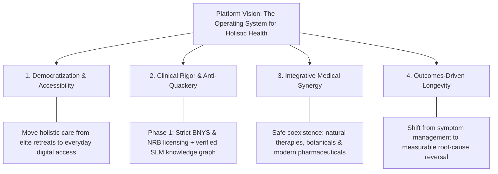

# Product Differentiation Strategy: AI-Native Naturopathy Platform

This document outlines strategic, creative, and highly defensible product differentiation ideas for your naturopathy platform. These features are designed to position your product as an AI-first, scientifically validated, and highly scalable market leader, bypassing the immediate need for a physical clinic footprint.

---

## Strategic Vision, Mission & Investor Narrative

### 1. The Core Problem (The "Why Now" for Investors)
*   **The Chronic Disease Trap:** Modern medicine (Allopathy) excels at acute emergencies and surgical care. However, for chronic lifestyle disorders (Type-2 diabetes, hypertension, PCOS, gut dysbiosis, chronic inflammation), modern healthcare often provides lifelong symptomatic suppression—*"a pill for every ill."*
*   **The Traditional Healing Deficit:** Classical Naturopathy addresses the root cellular and metabolic causes without side effects, but suffers from:
    1.  **Extreme Fragmentation:** Highly scattered, unorganized individual practitioners.
    2.  **Credibility & Quackery:** Pervasive pseudo-practitioners diluting patient trust.
    3.  **High Inaccessibility:** Available predominantly as expensive, 7-to-15 day luxury retreats (e.g., Jindal, Kshemavana), making regular outpatient care virtually nonexistent.
    4.  **Clinical Disconnect:** Zero digital infrastructure to cross-check natural protocols against ongoing allopathic prescriptions.

---

### 2. The Vision Statement (10-Year North Star)
> **"To make evidence-based, root-cause holistic healthcare as scientific, verifiable, and universally accessible as modern medicine."**

### 3. The Mission Statement (The Daily Engine)
> **"To build the world’s first AI-native Holistic Health operating system—unifying verified clinical practitioners, AI-powered root-cause diagnostics, and personalized lifestyle medicine into safe, integrative care."**

---

### 4. The 4 Strategic Pillars

*   **Pillar 1: Democratization (Accessibility):** De-luxurify holistic healing. Transform complex, multi-week residential therapies into bite-sized, at-home, daily health routines supported by intelligent software.
*   **Pillar 2: Clinical Rigor (Credibility):** Eliminate quackery. Build a walled garden anchored initially in verified BNYS doctors (Phase 1) and expand to accredited integrative practitioners, backed by a domain-specific SLM trained exclusively on authorized clinical knowledge.
*   **Pillar 3: Integrative Medical Synergy (Safety & Coexistence):** Reject anti-medicine dogma. Recognize that natural therapies, botanical extracts, nutrition, and modern pharmaceuticals each have legitimate clinical roles. The platform acts as the safe coordinating layer ensuring all modalities work in harmony.
*   **Pillar 4: Outcomes-Driven Longevity (The North Star Metric):** Align platform incentives with measurable health outcomes—specifically chronic disease reversal, metabolic marker optimization (HbA1c, lipid profiles, inflammatory markers), and long-term vitality.

---

## The AI Core: Leveraging Your Domain-Specific SLM (Small Language Model)

Your approach of using a **domain-specific SLM** trained on authorized, validated texts (like NIN publications, AYUSH guidelines, and clinical studies) is a strong foundation. To make it a primary selling point to investors, position it as:
*   **Defensibility:** A proprietary knowledge graph that generic LLMs (like standard GPT or Gemini) cannot replicate because it is trained on curated, non-public, or highly specialized integrative medical data.
*   **Safety & Compliance:** The model has built-in guardrails, using a customized, clinically validated vocabulary that ensures it doesn't give risky advice or claim "magic cures."

---

## 6 Creative Product Differentiators

Here are six high-impact, digital-first features that differentiate your product from general directories like *NatureFit* or telemedicine tools like *Lybrate*:

### 1. "DIY At-Home Naturopathy Kits" + Visual AI Guidance
Since physical centers are difficult to establish early on, bring the physical therapy to the patient's home.
*   **How it Works:** Naturopathy treatments are fundamentally simple (mud packs, cold compresses, steam, herbal eye packs, spinal baths). When a doctor prescribes a therapy, the platform ships a **"DIY Nature-Cure Kit"** containing sterilized, therapeutic local clays, customized packs, reusable wraps, and basic instruments.
*   **The AI Layer:** Inside the app, the patient uses the camera. The **Visual AI** guides them in real-time:
    *   "Apply the mud pack 2cm thick. Keep it on for 20 minutes."
    *   It uses object tracking to ensure the pack is in the right area (e.g., abdomen vs. forehead).
    *   Sends smart reminders on when to switch from hot to cold compress.
*   **Investor Pitch:** Combines SaaS/Telehealth with a tangible **e-commerce recurring revenue stream** (physical kits), solving the physical therapy gap without clinic overhead.

### 2. Allopathy-AYUSH Interaction & Safety Checker (The "Safe-Guard" Engine)
Most chronic patients are already taking modern medicines (e.g., Metformin for diabetes, Statins for cholesterol). They worry about how natural therapies will affect their medical treatment.
*   **How it Works:** The patient uploads their modern medical prescriptions (via OCR scan). The **SLM Safety Engine** cross-references these with any prescribed naturopathic diet, juice therapy, or herbal supplement.
*   **The AI Layer:**
    *   Flags potential contraindications (e.g., "A high-potassium juice therapy is risky with your current BP medication").
    *   Generates a safe, complementary plan that works *alongside* allopathy.
*   **Investor Pitch:** Solves the major "safety and trust" barrier. Position your product as the first **Integrative Medical safety engine** that bridges modern science and natural healing.

### 3. Circadian Biology & Natural Element Tracker
Standard health apps track steps, water, and calories. Naturopathy is built on living in sync with nature (circadian rhythm, sunlight, water, air).
*   **How it Works:** The app tracks the patient's exposure to the natural elements.
*   **The AI Layer:**
    *   **Sunlight Coach (Suryachikitsa):** Uses geo-location and local UV index to tell the user exactly when and for how long to get morning sun exposure for optimal vitamin D and circadian sync.
    *   **Circadian Meal Timer (Akashchikitsa/Fasting):** Coordinates eating/fasting windows based on the body's natural metabolic peaks rather than static calorie counts.
    *   **Pranayama / Air Coach (Vayuchikitsa):** Uses the phone's microphone to analyze breathing patterns and guide patients through customized natural breathing exercises.
*   **Investor Pitch:** Moves the app from a "teleconsultation platform" (low usage frequency) to a **daily lifestyle companion** (high daily active usage - DAU).

### 4. B2B AI Copilot for Allopathic (MBBS/MD) Doctors
Instead of only catering to the ~15,000 BNYS doctors, target the millions of general practitioners who lack the time to design diet and lifestyle plans.
*   **How it Works:** Allopathic doctors write their chemical prescriptions. Then, they use your B2B AI Copilot to generate a complementary, evidence-backed "lifestyle prescription" (Diet, sleep hygiene, stress management) in 10 seconds.
*   **The AI Layer:** The copilot ingests the patient's diagnosis and generates a lifestyle document that the MBBS doctor can print or send to the patient, co-branded with your platform's name.
*   **Investor Pitch:** Unlocks a massive B2B medical market. Position your product as an **enablement tool** for modern clinics to offer holistic wellness.

### 5. AI-Powered Constitution (Prakriti) & Tongue Diagnostic
A gamified, interactive diagnostic tool to capture leads and engage users.
*   **How it Works:** In naturopathy, the state of the tongue, face, and voice indicates systemic toxicity (*Toxaemia*) and overall body constitution.
*   **The AI Layer:**
    *   Users take a high-resolution selfie of their tongue and face.
    *   The Computer Vision AI analyzes color, coating, and texture (e.g., thick white coating indicative of poor digestion/toxin buildup).
    *   It outputs a "Toxicity & Constitution Report" and recommends booking a consult with a verified BNYS doctor on your platform.
*   **Investor Pitch:** A high-conversion lead generation tool that drives organic growth and virality.

### 6. Symptom-Based Naturopathic Routing Engine
An automated triage system that analyzes holistic symptoms and routes the patient to the most suitable practitioner.
*   **How it Works:** When signing up, patients fill out a holistic "Treatment Form" outlining symptoms, duration, diet, sleep, digestive issues, and energy levels.
*   **The AI Layer:** Instead of basic keyword matching, your SLM parses the multi-dimensional intake data to construct a "Naturopathic Health Profile." It automatically routes the user to a BNYS doctor who specializes specifically in that cluster of conditions (e.g., matching a patient with a thyroid + gut issue to a practitioner who has high historical treatment efficacy for thyroid-gut axes). It also pre-generates a clinical summary report for the doctor, reducing consult preparation time by 80%.
*   **Investor Pitch:** Streamlines user boarding and optimizes treatment efficacy. Unlike competitors who route based on simple availability or generic allopathic specialties, you route based on **holistic naturopathic expertise compatibility**.

---

## Differentiation Matrix: How You Compare

| Feature | Generic Portals (Lybrate/Practo) | CAM Platforms (NatureFit) | **Your AI-Native Platform** |
| :--- | :---: | :---: | :---: |
| **Focus** | Allopathy / Generic | Generic AYUSH / Products | **Naturopathy & Circadian Health** |
| **Practitioner Trust** | Low validation (anyone can list) | Medium validation | **Strict BNYS & NRB verification** |
| **AI Capabilities** | None (pure directory) | Basic chat / BMI tools | **Domain-Specific SLM Copilot** |
| **Treatment Safety** | N/A | None | **Allopathy-AYUSH Drug Checker** |
| **Patient Routing / Triage** | Instant match based on availability & allopathic specialty | Manual search / Directory booking | **AI Naturopathic Routing (holistic symptom-profile mapping)** |
| **Physical Therapy** | Online booking only | Online booking only | **Visual AI + DIY At-Home Treatment Kits** |
| **Diagnostic Entry** | None | Simple survey forms | **Computer Vision Tongue & Face Analysis** |

---

## Phased Implementation Roadmap

To show investors you are realistic and capital-efficient, structure your roll-out in phases:

```mermaid
flowchart LR
    subgraph P1["Phase 1: Foundation & Triage"]
        direction TB
        A1["SLM-backed Query Mode"]
        A2["Verified BNYS Directory"]
        A3["AI Symptom-Based Routing"]
    end

    subgraph P2["Phase 2: Trust & Daily Engagement"]
        direction TB
        B1["Allopathy-AYUSH Safety Engine"]
        B2["Circadian & Natural Element Tracking"]
    end

    subgraph P3["Phase 3: Diagnostics & Physical Therapy"]
        direction TB
        C1["Computer Vision Tongue & Face Analysis"]
        C2["DIY At-Home Naturopathy Kits"]
    end

    subgraph P4["Phase 4: Ecosystem & Scale"]
        direction TB
        D1["O2O Partner Clinic Referrals"]
        D2["B2B Allopathic Doctor Copilot"]
    end

    P1 --> P2 --> P3 --> P4
```

